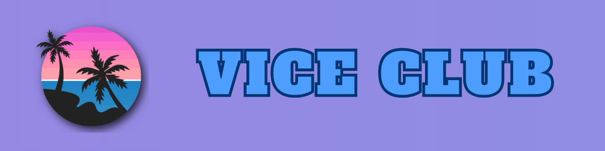

# Vice Club

  

---

## About the Project

**Vice Club** is a fan-made website dedicated to preserving and organizing content from the *Grand Theft Auto* series in a clean, immersive, and highly accessible way.

The project aims to recreate the authentic GTA experience directly in the browser — featuring playable radio stations, interactive maps, completion checklists, and richly detailed game information.

Continuously updated and expanded, Vice Club keeps growing with new features and content.

---

## What You'll Find

### Radio Stations

One of the core features of Vice Club.

Listen to the original in-game radio stations with:

- Background playback
- Detailed song information
- Genre categorization
- Talk shows and original segments

---

### Interactive Maps

Carefully designed interactive maps to assist you while playing. They include:

- Collectibles
- Weapons
- Properties
- Points of interest

---

### 100% Completion Checklists

Track your progress toward 100% completion directly in the browser.

Progress is saved automatically in your device, so you can continue exactly where you left off (just don't clear your site data).

---

### Game Information

Each game has its own dedicated section with well-organized content, including:

- Main and supporting characters
- Quotes
- Fact sheets and trivia

---

### Cheat Codes

Complete cheat code lists for multiple platforms, with a built-in search function for quick access during gameplay.

---

### Mods & Tools

A curated collection of useful community mods, tools, and resources to enhance the PC experience.

---

## Built With

Originally started as a vanilla HTML project, Vice Club later transitioned to **Astro** for better scalability. Much of the site still uses vanilla components where possible.

---

## Currently Working On

I'm currently working across multiple areas of the project. You can check the active development status in the [Issues section](https://github.com/sebastian-fraga/viceclub/issues).

---

## Disclaimer

Vice Club is an independent website. 

*Grand Theft Auto* and *GTA* are registered trademarks of **Rockstar Games** and **Take-Two Interactive**. 

This website is not affiliated with, sponsored by, or associated with either company.