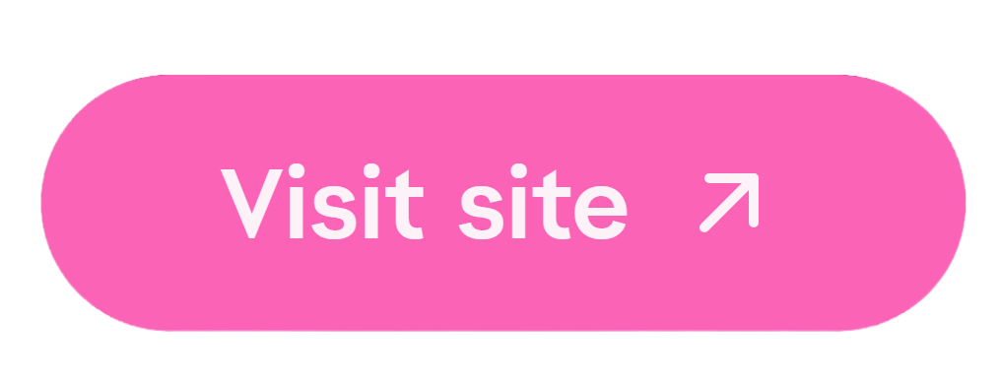
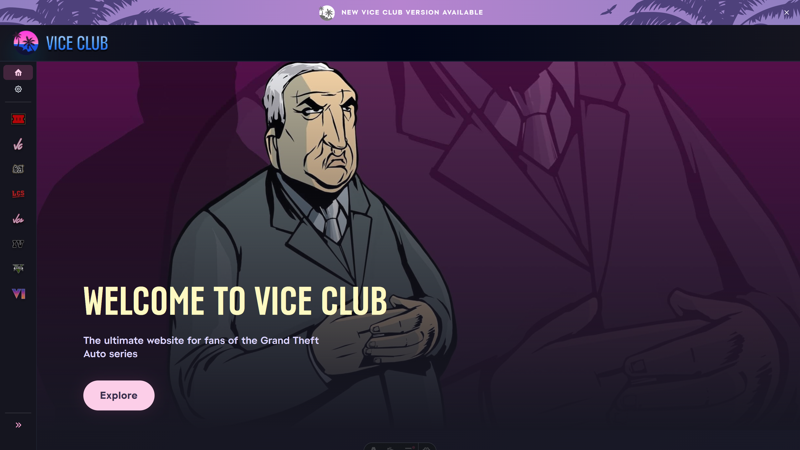
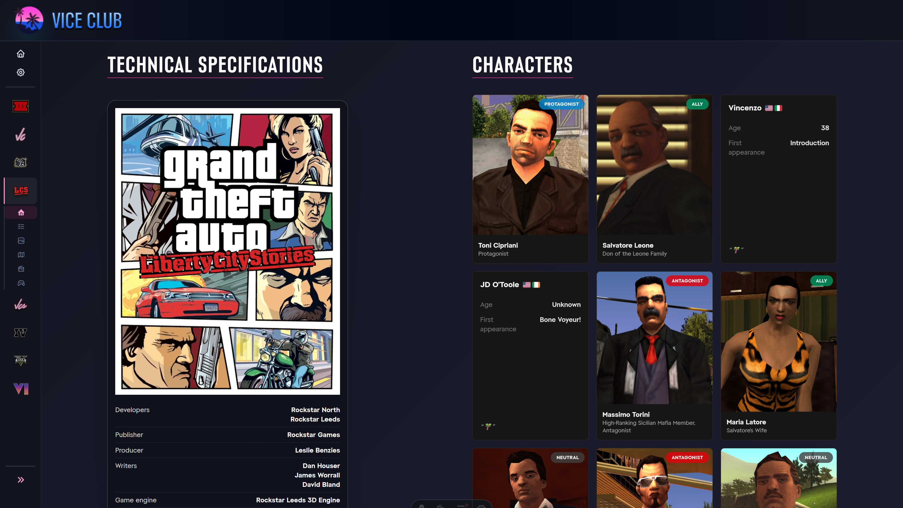
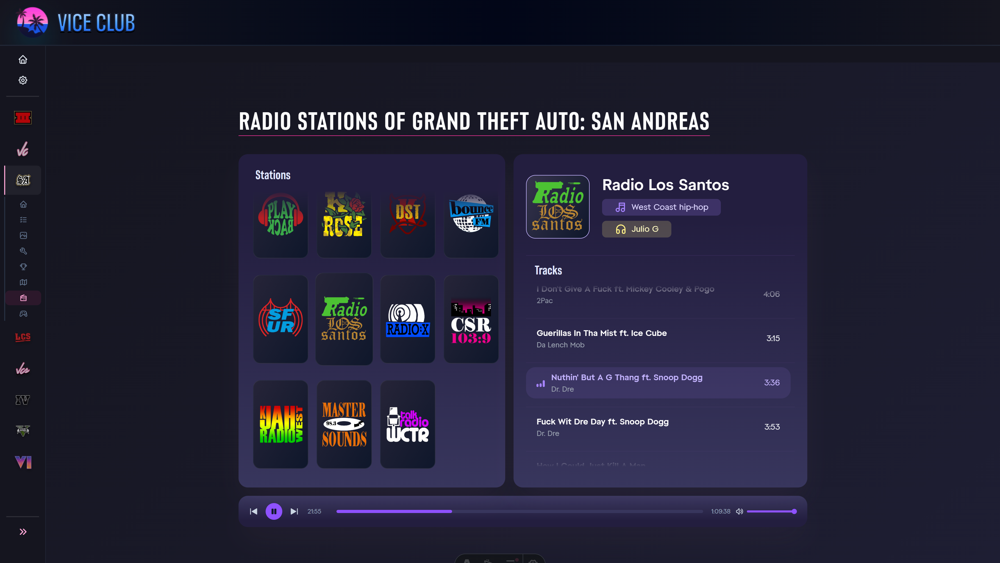
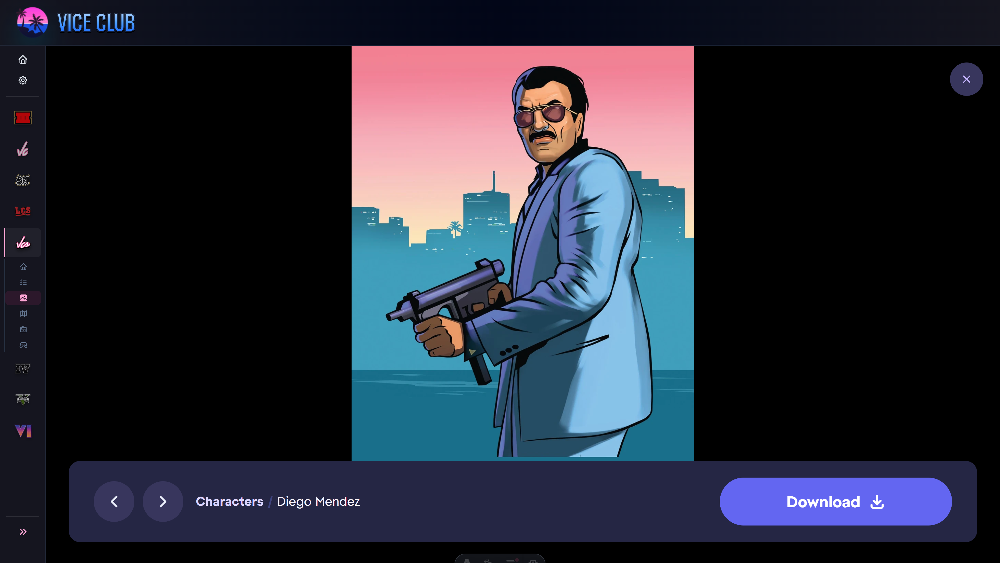
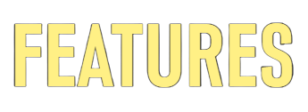
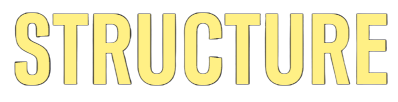
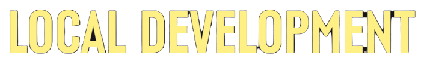
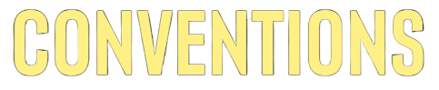

GTA III, Vice City, San Andreas, Liberty City Stories, Vice City Stories, GTA IV, GTA V, and GTA VI fan site: cheats, information, artworks, mods, achievements, interactive maps, and more.

<p align="center">
  <a href="https://viceclub.app">
    
  </a>
</p>


<br><br>
<div align="left">
  
</div>
<br>

<div align="center">
  
  
  
  
</div>

<br><br>
<div align="left">
  
</div>
<br>


<br><br>
<div align="left">
  
</div>
<br>

| Feature         | Status |
| --------------- | ------ |
| 📰 News         | ✅     |
| 📋 Checklists   | ✅     |
| 🎨 Artworks     | ✅     |
| 🛠️ Tools & mods | 🚧     |
| 🏆 Achievements | 🚧     |
| 🗺️ Map          | 🚧     |
| 📻 Radio        | ✅     |
| 🕒 Timeline     | ✅     |
| 🎮 Cheats       | ✅     |

<br><br>
<div align="left">
  
</div>
<br>

```text
src/
├── components/
│   ├── artworks/
│   ├── home/
│   ├── index/
│   ├─── radio/
│   └── ...
├── layouts/
│   ├── BaseLayout.astro
│   └── ErrorLayout.astro
├── pages/
│   ├── [game].astro
│   └── static routes
```

<br><br>
<div align="left">
  
</div>
<br>

```bash
git clone https://github.com/sebastian-fraga/viceclub.git
cd viceclub
pnpm install
pnpm run dev
```

<br><br>
<div align="left">
  
</div>
<br>

- Custom breakpoints: `max-mobile:` for inverse mobile-first overrides
- Per-game theming via `--game-accent` (CSS custom property)
- Shared hooks in `useSettings`/`AppContext` for persistence (localStorage)
